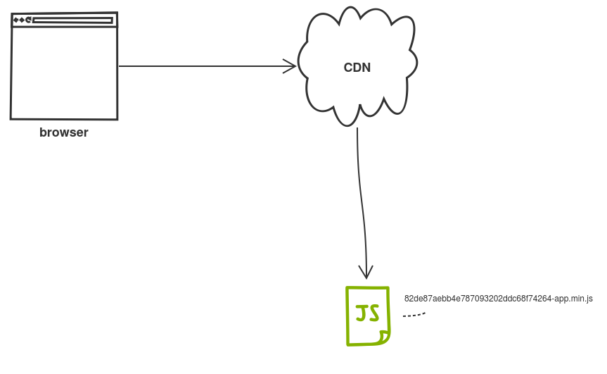

Minish
======

Simple helper written in Go to hash JavaScript file name. Hashed names help to load newest file with the web page. Hashed names allow to utilize long cache expiration times, e.g. Cache-Control:max-age=2592000.

Makes sure that latest JavaScript files are loaded. After minishing javascript files, browsers, CDNs and other caching proxies will not prevent loading the latest versions of your application.

Removes previously minified files from the output folder that ends with the -<filename>.min.js | <filename>.min.css

Examples:

go run main.go example.js dist

=> dist/3a25a3cfb1481a9b3496ca870564dff5-example.min.js

go run main.go -css example.css dist

=> dist/d560e98e1b167635837291f8e54628e3-example.min.css

Snippets
--------

Snippets directory contains utils that can be used to find minished files in Go and Scala. Those can be used find latest hashed version e.g. on web application boot.

Usage
=====

minish \<unminified javascript file\> \<output dir\>

Dependencies
------------

### Install UglifyJS2

https://github.com/mishoo/UglifyJS2

### install clean-css
https://github.com/jakubpawlowicz/clean-css
